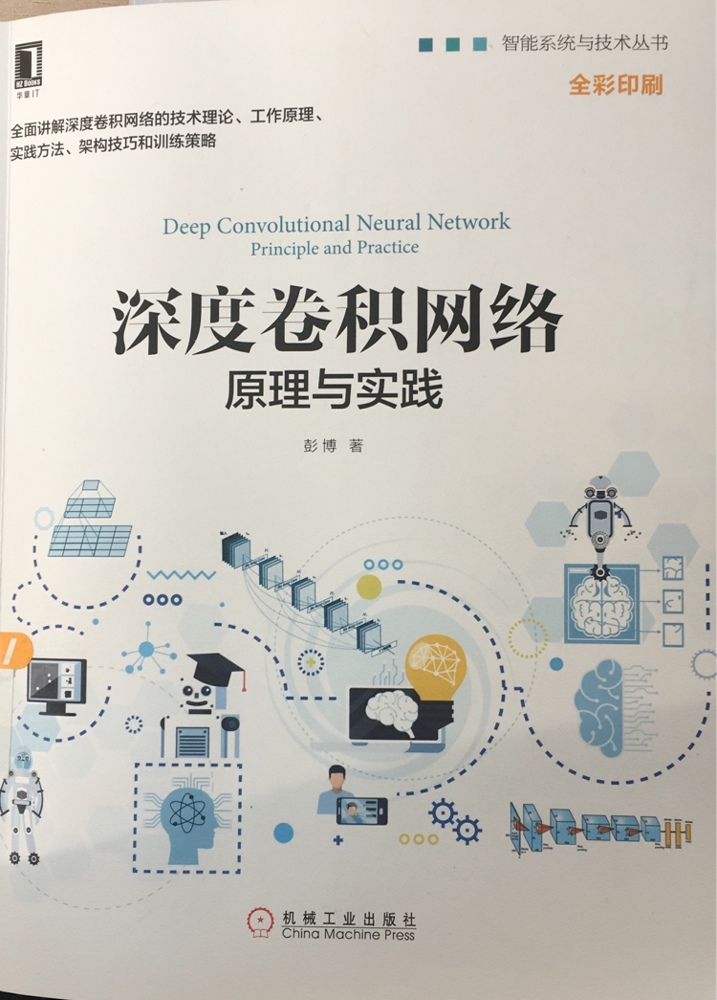

# 深度卷积网络

some code implementation of the book *Deep Convolutional Neural Network: Principle and practice(深度卷积网络：原理与实践, 机械工业出版社, 彭博@著)*

## 1. the book cover

## 2. contents

| filename | description | state | 
| :-: | :- | :-: | 
|DCNN_PP.pdf| 手写读书笔记|Finished| 
|chapter_2_1.py|MXNET框架实现最简单的一组数字找大小二分类任务训练(page 73)|Finished|
|download_data.sh|a linux shell script to download MINIST dataset and fashion-MINIST dataset|Finished|
|chapter_3_1.py|MXNET框架实现MLP用于MINIST数据集|Finished|
|chapter_4_1.py|A implementation of basic CNN with MINIST dataset|Finished|
|chapter_4_2.py|A simpler implementation of basic CNN with MINIST dataset, which can quickly define network structures with functions, and which includes how to save and load pre-trained model.|Finished|
|chapter_4_3.py|using example in chapter_2_1.py to explore training details about back propagation algorithms in MXNET framework|Finished|
|chapter_5_1.py|data augmentation and rebuild model structure for Fashion-MNIST|Finished|
|prepare_cifar.sh|a script for download cifar-10 dataset and then packing it into RecordIO format|Finished|
|im2rec.py|a data process tool from MXNET framework to change images data to MXNET.RecordIO format|Copied|
|chapter_5_2.py|a deeper model and RecordIO data for cifar-10|finished|
|chapter_5_3.py|defination of residual neural network with pre-act structure|Finished|
|chapter_5_4.py|a pre-cat ResNet model for cifar-10|Finished|
|chapter_8_dcgan.py|a implementation of DCGAN(deep convolutional generative adverisial netowrk) with MXNET framwork|Finished|